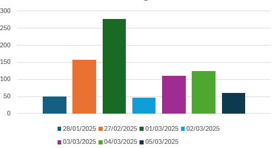

|Tarea 📋|Autor 🖊️|Fecha inicio (con hora) 📅|Fecha fin (con hora) ⏳|Tiempo transcurrido ⏱️(aprox)|
|-----|-----|-----------------------|--------------------|-------------------|
|Ticket + Ubicacion|Andrei|27/02/2025/10:01|27/02/2025/10:57|56m|
|Plano Parquing| Andrei| 27/02/2025/9:42|27/02/2025/10:01|19m|
|Depósito+Tipo moneda|Nicolás|27/02/2025/9:37|27/02/2025/11:00|1h23|
|Rematando Plano|Andrei|28/01/2025/13:05|28/01/2025/13:27|22min|
|Representación depósito+tipo moneda|Nicolás|28/01/2025||15m|
|Representación ticket+plano+ubicación|Andrei|28/01/2025/13:28|28/01/2025/13:56|28min|
|Representación depósito+tipo moneda|Nicolás|28/01/2025/|28/01/2025/|15m|
|Máquina|Andrei|01/03/2025/12:05|01/03/2025/13:30|1h25|
|Principal|Andrei|01/03/2025/14:50|01/03/2025/15:20|30min|
|Esquemas Máquina y Principal|Andrei|01/03/2025/15:30|01/03/2025/16:15|45min|
|Revisión código + recolocación archivos|Nicolás|01/03/2025/19:00|01/030/25/19:12|12m|
|Integración aparcar + inicio método pago|Nicolás|01/03/2025/19:00|01/03/2025/20:45|1h 45m|
|Finalizar integración pago|Nicolás|02/03/2025/19:24|02/03/2025/20:10|46m|
|Modificación Principal + revisión Ticket|Andrei|03/03/2025/8:30|03/03/2025/9:19|1h|
|Modificación esquema Principal|Andrei|03/03/2025/9:06|03/03/2025/9:22|12min|
|Revisión código|Andrei|03/03/2025/9:24|03/03/2025/9:40|16min|
|Manejo de excepciones + ajustes ventanas (principal y barra)|Nicolás|03/03/2025/20:45|03/03/2025/21:15|30m|
|Remisión de código|Andrei|04/03/2025/8:50|04/03/2025/9:21|31min|
|Esquema Terminal|Andrei|04/03/2025/9:22|04/03/2025/9:45|23min|
|Integración parcial de la ocupación + ajustes código para implementación |Nicolás|04/03/2025/13:10|04/03/2025/14:20|1h 20m|
|Arreglos de código, ajustes readme, rediseño terminal + añadir graficos tiempo| Nicolás|05/03/2025/16:35|05/03/2025/17:35|1h|

## Total de tiempos

Nicolás → 6 Horas y 34 minutos
 
Andrei → 6 Horas y 47 minutos
 
Total -> 13 horas y 21 minutos

## Tiepo imbertido 

>En minutos
