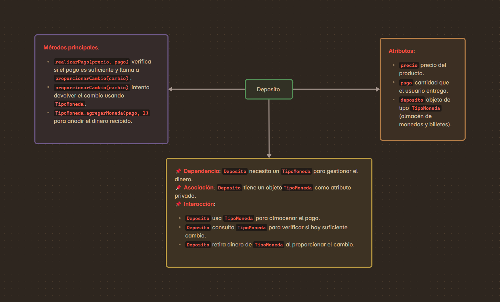
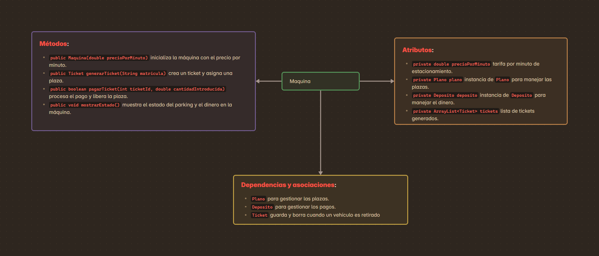
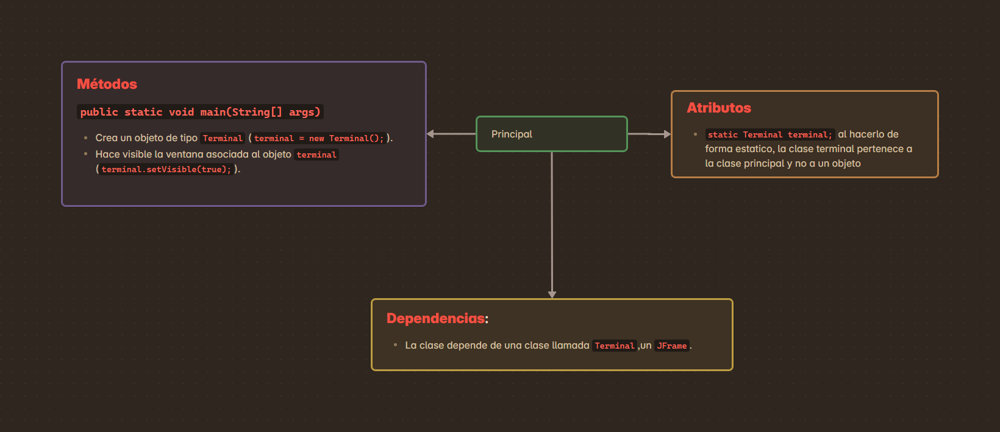
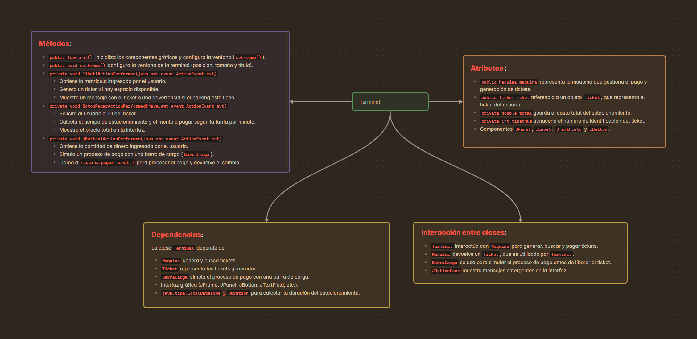

# Clases necesarias

- [x] Principal
- [x] Maquina
- [x] Terminal
- [x] Tiket
- [x] Ubiacion planta (mapa de parquing)
- [x] Deposito

# Distribución

## Principlas

Encargada de crear una *instancia* de la `MAQUINA` del parking, pasándola el **precio/minuto** como un double

## Maquina

Tiene incorparado la `terminal` con la que el usuario interectuara para acciones como **APARCAR** O **SACAR VIECULO**

### Composición 

La **`Maquina`** tendra acceso a :

| Función| Descripción|
|--------|------------|
| `La terminal` | Pudiendo controlar el funcionamiento de la maquina|
| `Deposito` | Control de la cantidad de monedas y billetes de cada tipo disponibles en la máquina|
|ArrayList| Almacena los `tiquets` generados|
| `Plano del camping` | Matriz en el que se ve la disponibilidad del parquing (poniendo 0 donde esta bacio y si esta ocupado aparece el **ID** del tiquet)|


## Tiquet

Presenta informacccion al salir del parquing como : 
````
información: un identificador único, matrícula del coche, fecha/hora de entrada y UBICACIÓN (planta/plaza) asignada
````

# Representacion visual de cada clase

## Deposito

## Maquina

## Plano

## Principal

## Terminal

## Tiket

## Tipo Monedas

## Ubicación


